# BlinkFusion Tutorial and User Guide

This tutorial serves the purpose of briefly providing guidelines on how to use the functionalities offered by the **BlinkFusion** app. We will cover the workflow starting from the **Welcome** page—where relevant paths are defined—through **Preprocessing**, **Batch Analysis** for both **Filament** and **STORM** analyses, and finally the different functionalities offered in the **Results Dashboard** for both analysis types.

Before going through this tutorial please remember to follow the guidelines in https://github.com/Alejandro1400/BlinkFusion to install and start using the app.

Throughout the app, you will encounter `(?)` symbols that provide concise explanations of what is being displayed and describe the available functionalities while using the app.

---

## 1. Welcome

When opening the app, you are introduced to a simple welcome page.

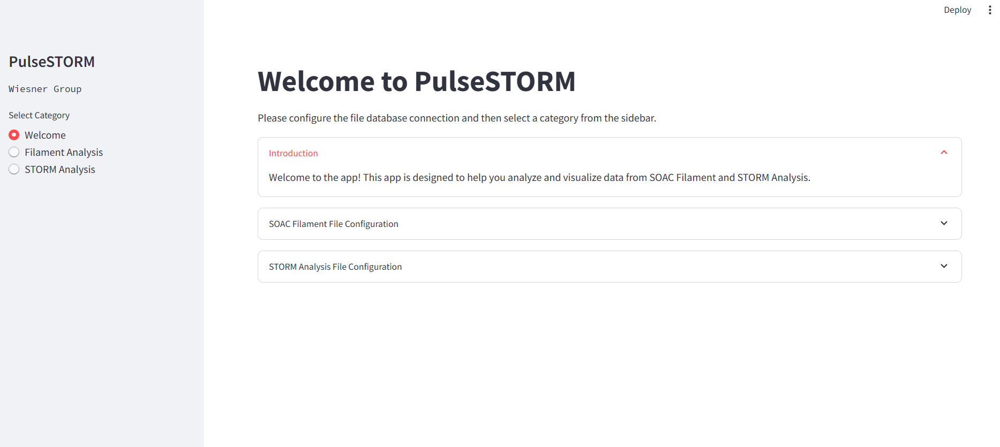

Here, two configurations are relevant.

---

### 1.1 SOAC Filament File Configuration

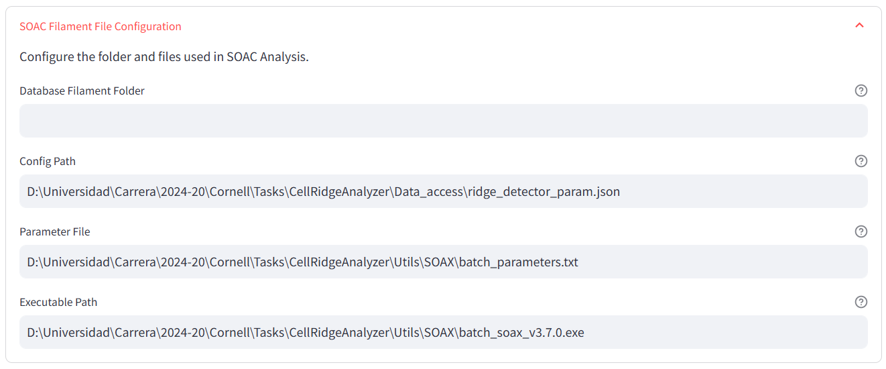

In this section, you will first define the folder where images, data analysis outputs, and results will be stored. It is recommended that this path points to your **local hard drive** to improve performance.

Next, you must configure the parameters for the **ridge detection software**. Users are encouraged to follow the ridge detection tutorial to understand how each parameter should be determined through a quick exploratory analysis using **ImageJ-Fiji**.

**Reference (Ridge Detection Implementation):**
Wagner, T., Hiner, M., & Xraynaud. (2017). *thorstenwagner/ij-ridgedetection: Ridge Detection 1.4.0* (Version v1.4.0). Zenodo.
DOI: 10.5281/ZENODO.845874

Finally, within the parameter file, you should define the values used for **batch SOAX analysis**. In most cases, the default values should be used, as they already include an optimized configuration for obtaining reliable SOAC results. Additionally, the executable path must be defined to point to the **SOAX software executable**, which is required for automatic batch processing.

**Reference (SOAX):**
T. Xu, D. Vavylonis, F. Tsai, G. H. Koenderink, W. Nie, E. Yusuf, I.-J. Lee, J.-Q. Wu, and X. Huang,
*SOAX: A Software for Quantification of 3D Biopolymer Networks*, Scientific Reports, 5, 9081 (2015).
DOI: 10.1038/srep09081

All these paths—except for the results and image folders—are defaulted to internal paths within the software. Users are encouraged to adapt parameters as needed for their specific experiments.

---

### 1.2 STORM Filament File Configuration

For STORM analysis, only the **results folder** needs to be defined in this configuration section.

---

### 1.3 Analysis Sidebar and Progress Indicators

On the left side of the screen, you will find a sidebar that allows access to either **Filament Analysis** or **STORM Analysis**.


When any analysis is selected, datasets from the corresponding folders—and, in the case of STORM, from the Mongo database—are loaded into the Streamlit instance. The sidebar also displays progress indicators showing what step of the process is currently running.

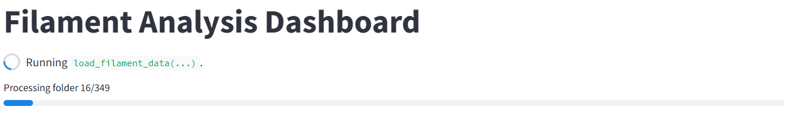

These progress bars allow users to quickly understand which part of the pipeline is being executed. For more detailed information, users can always refer to the terminal output.

---

## 2. Preprocessing Data

The purpose of the preprocessing step is to load images and datasets into the **Data Folder** and to assign **metadata** for comparative analysis.

Users must define the folder containing the images to be processed. A hierarchical folder selection is supported, allowing the software to recursively traverse nested directories and load their contents. This approach should only be used when the parameters to be assigned—such as particle type—are consistent across all samples within the selected folders.

Certain metadata values are automatically extracted from **Zeiss microscope files** and **TIF metadata**, such as image size. In addition, the app allows users to define custom metadata fields, enabling structured organization of datasets for downstream analysis.

For **STORM processing**, users are encouraged to name image files using the convention:

```
Image.._angleX_laserX_expX_gainX
```

These values are often not provided directly by the microscope metadata, so encoding them in the filename during data acquisition significantly speeds up preprocessing. Alternatively, these values can also be defined later using **Database Metadata** or **Add New Metadata**.

The preprocessing interface is divided into several tabs.

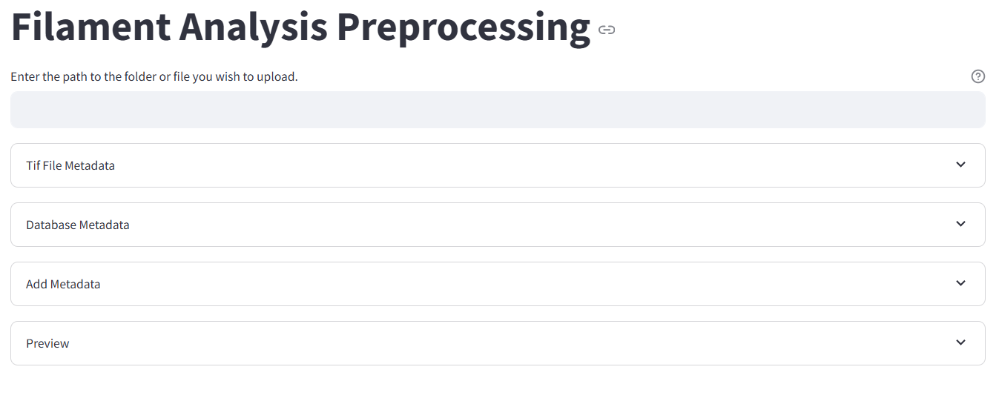

---

### 2.1 TIF or CZI File Metadata

In this tab, metadata relevant to the study—such as image size, laser settings, acquisition date, and number of frames—are automatically extracted from the input files. TIF files are used for filament analysis, while CZI files are used for STORM analysis.

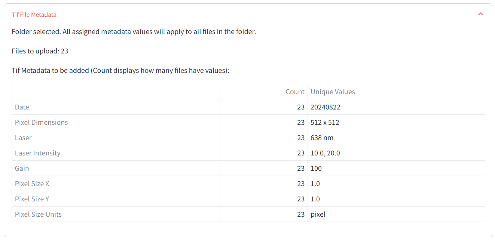

---

### 2.2 Database Metadata and Add New Metadata

Because metadata selection is user-defined, the **Add Metadata** tab allows users to create new metadata entries for comparative analysis. Users specify the metadata name, variable type, and value.

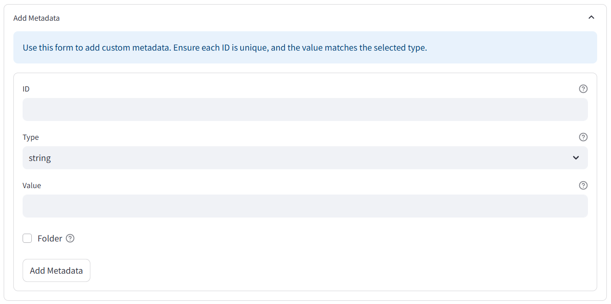

Once a new metadata value is added, it becomes available in the **Database Metadata** tab. To maintain consistency and speed up metadata assignment, users can select from existing values, add new ones, or assign a null value when appropriate.

A folder-level checkbox is also available. By default, files are sorted by date; however, users can define alternative organizational schemes based on metadata values to improve dataset structure in the file system.

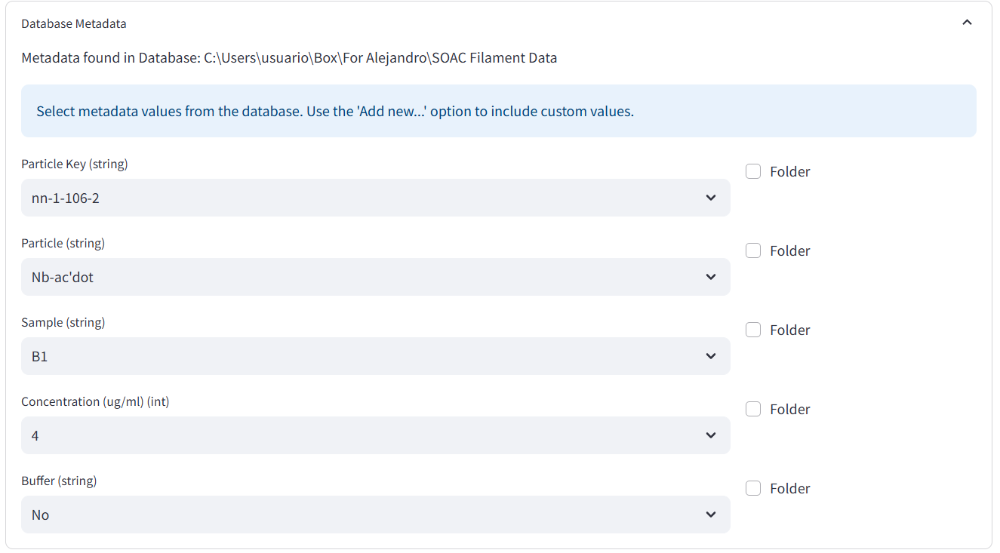

Finally, the **Preview** tab displays the resulting metadata assignments for the selected datasets. When files are uploaded, the preprocessing steps are executed. As a result, the selected folder will contain a structured dataset with one folder per dataset, a corresponding TIF image (for STORM analysis, CZI files are converted to TIF), and embedded metadata.

A progress bar indicates the preprocessing status for each uploaded file.

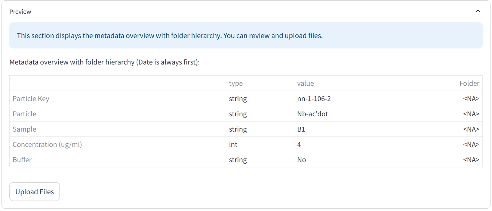

---

## 3. Batch Processing

During the batch processing step, the software scans all dataset folders and identifies which ones are eligible for batch analysis. Eligible datasets are those that were added during preprocessing and have not yet undergone batch processing.

By default, all filament datasets are ready for batch processing immediately after preprocessing. In contrast, STORM datasets require prior processing with **ThunderSTORM** in ImageJ. Users must export localization results as CSV files with the suffix `_locs.csv`, placed in the same folder as the original image.

**Reference (ThunderSTORM):**
M. Ovesný, P. Křížek, J. Borkovec, Z. Švindrych, and G. M. Hagen,
*ThunderSTORM: a comprehensive ImageJ plugin for PALM and STORM data analysis and super-resolution imaging*,
Bioinformatics, 30(16):2389–2390 (2014).

The batch processing interface displays detailed progress information for each image. This is particularly useful for STORM localization analysis, which can take several minutes per dataset. An estimated remaining processing time is provided.

For filament analysis, batch processing generates CSV files containing SOAC statistics from the highest-quality regions identified by the ridge detection software. For STORM analysis, results are uploaded to the Mongo database in a structured JSON format.

---

## 4. Dashboard Comparative Analysis

The analysis workflow is similar for both filament and STORM datasets, with the main difference being that the STORM dashboard includes more detailed single-image analysis. Due to the stochastic nature of STORM data, individual datasets should be carefully examined, with comparative analysis serving as an initial exploratory tool.

Both dashboards provide:

* An initial filtering step
* Quantitative data analysis
* Comparative graphical analysis

---

### 4.1 Filtering Step

The filtering step is divided into two sections.

#### 4.1.1 Filter Metadata Options

In this section, users select specific metadata values to filter datasets, such as acquisition date, particle type, or experimental condition.

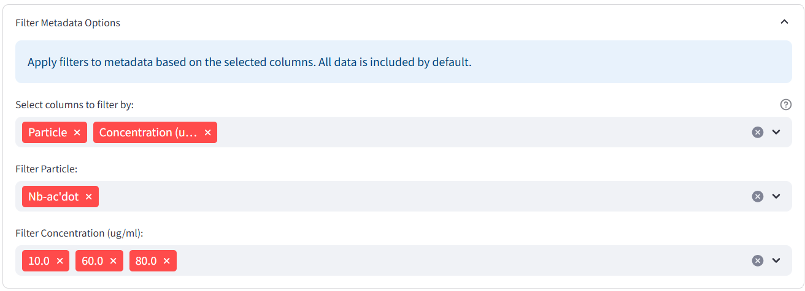

---

#### 4.1.2 Filter Data

This section is specific to filament analysis and allows users to exclude filaments that do not meet expected criteria. For example, if longer filaments are known to be more reliable, users can filter by minimum length.

The interface also displays the number of remaining filaments after filtering, ensuring that sufficient data points are retained for comparative analysis. This functionality was used extensively during research and validation to remove outliers.

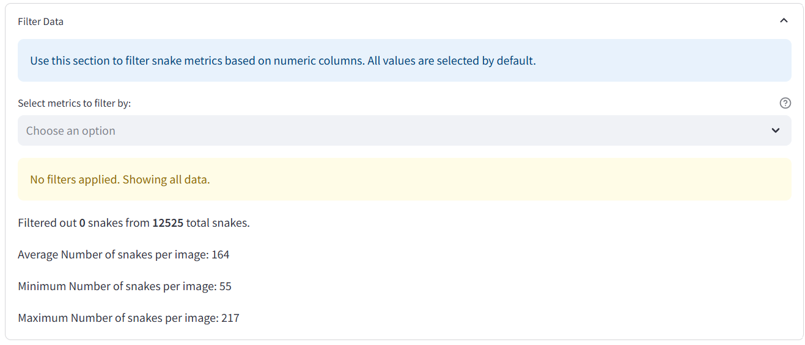

---

### 4.2 Analysis

#### 4.2.1 Data Analysis

The data analysis section displays mean values and standard deviations for quantitative metrics. Results are grouped hierarchically based on user-selected metadata.

These results can be exported as tables for rapid interpretation and inclusion in presentations or reports.

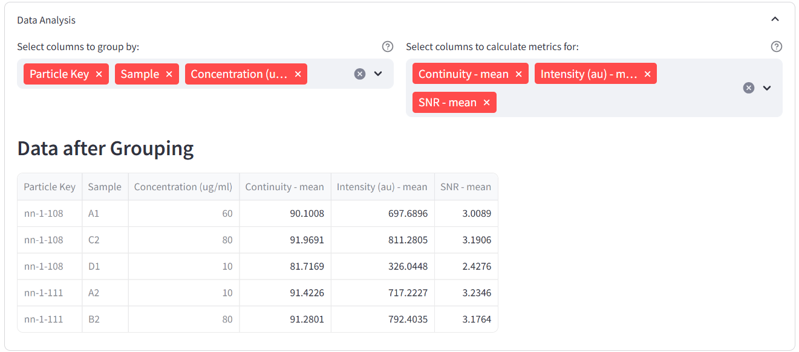

---

#### 4.2.2 Comparative Graphs Analysis

This section enables visualization of the same quantitative results using multiple plot types, including histograms, line plots, bar charts, and violin plots. Users can quickly generate comparative figures and export them for further use.

---

## 5. Single Image Dashboard Analysis for STORM

STORM analysis includes a dedicated **single-image dashboard**. As in previous steps, users first filter and select the image to analyze. Once selected, detailed metrics are displayed.

---

### 5.1 Time Series Analysis

This section presents relevant blinking metrics—such as duty cycle, survival fraction, and intensity over time—computed in time windows of 50 seconds (based on the selected parameters).

Both graphical plots and corresponding tables are provided, allowing for quick inspection and export of time-series results.

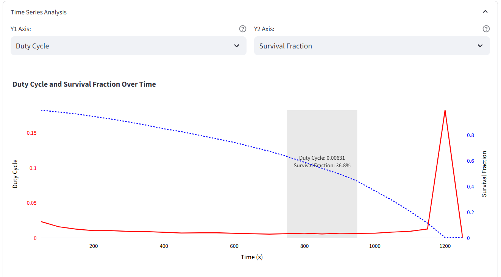

---

### 5.2 Histogram Analysis

Histogram analysis presents key blinking metrics with multiple analysis modes:

* **By molecule**, where values are grouped by the mean per molecule
* **By switching cycle**, where each on/off cycle is weighted equally

Users can customize the number of bins, restrict analysis to quasi-equilibrium populations (where duty cycle is most stable), and remove outliers. This is particularly important for mitigating artifacts and obtaining representative population-level estimates given the stochastic nature of STORM data.

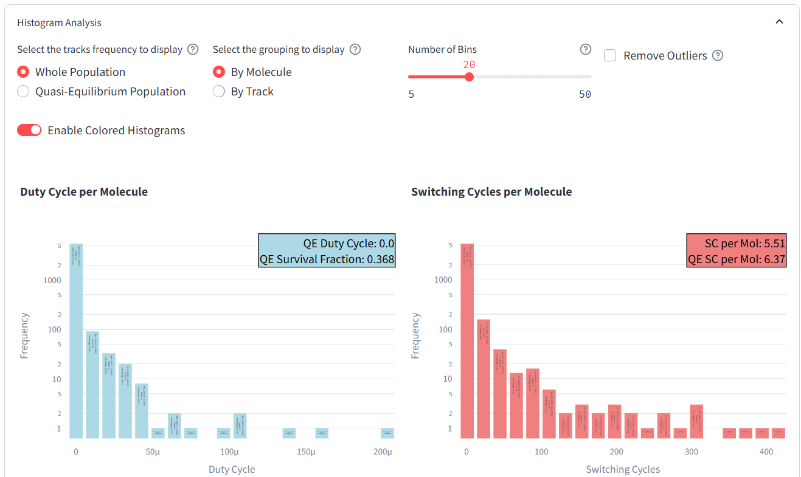

Exporting histogram values is also supported.

---

### 5.3 Blinking Classification

The blinking classification tool displays the intensity profile of individual molecules over time and provides a classification based on the number of on/off switching events and the duty cycle.

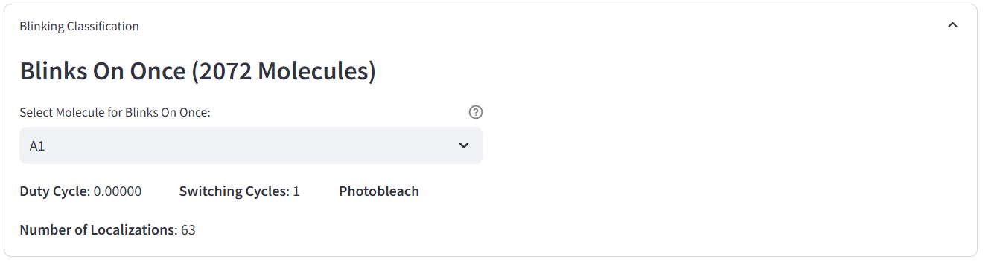
